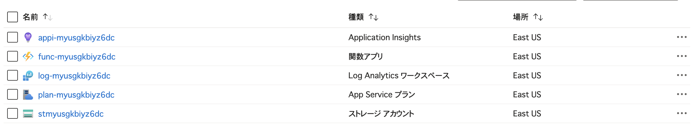
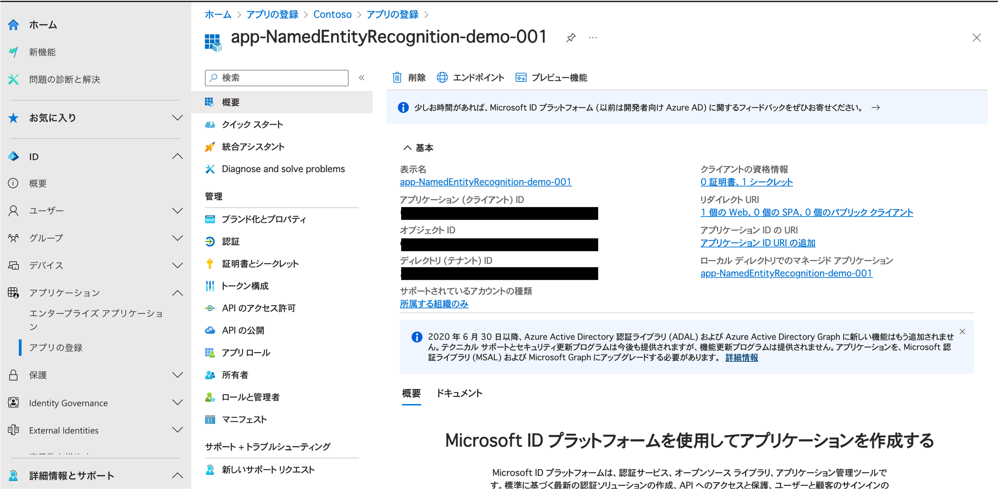

# Azure OpenAI を活用した固有表現抽出


## 0. 環境準備

プロジェクトを開始する前に、以下のツールがインストールされていることを確認してください。

- [Git](https://git-scm.com/download/win) - 本リポジトリをクローンするために必要です。

- [Azure CLI](https://learn.microsoft.com/ja-jp/cli/azure/install-azure-cli-windows?tabs=azure-cli) - Azure リソース展開時に必要です。

- [Azure Developer CLI](https://learn.microsoft.com/ja-jp/azure/developer/azure-developer-cli/install-azd?tabs=winget-windows%2Cbrew-mac%2Cscript-linux&pivots=os-windows) - Azure リソースを管理するために必要です。

- [Docker](https://docs.docker.com/engine/install/) - コンテナを展開するために必要です。

- [Azure Functions Core Tools](https://learn.microsoft.com/ja-jp/azure/azure-functions/functions-run-local?tabs=windows%2Cisolated-process%2Cnode-v4%2Cpython-v2%2Chttp-trigger%2Ccontainer-apps&pivots=programming-language-python#install-the-azure-functions-core-tools) - 関数アプリを展開するために必要です。

- [Python 3.11](https://www.python.org/downloads/) - 関数アプリを展開するために必要です。

以下のリソースがデプロイされます:

- **Resource Group**: リソースを管理するためのコンテナ（リソースグループ）。
- **Azure Monitor**: アプリケーションの監視とログ収集を行います。
- **Azure Storage**: データストレージと関数アプリのデプロイメント用のストレージを提供します。
- **Azure Functions**: サーバーレスアプリケーションをホストします。
- **Azure OpenAI**: OpenAIモデルのホスティングと管理を行います。
- **Azure Container Apps**: コンテナベースのアプリケーションをホストします。
- **Azure Container Registry**: Dockerコンテナイメージの管理を行います。

リポジトリをローカル環境にクローンします。

```
git clone https://github.com/kohei3110/aoai-ner.git
cd aoai-ner
```

## 1. Azure リソース作成

### 1-1. パラメーターファイルのコピーと修正

`infra/main.bicepparam` ファイルのパラメータの値を指定するように修正します。

デプロイ前に値を指定する必要があるパラメータは以下の通りです：

- environmentName: 作成されるリソースに使用される一意の名前。
- location: アセットが作成される場所。利用可能なリージョンは以下の通りです。

    - `australiaeast`
    - `eastasia`
    - `eastus`
    - `eastus2`
    - `northeurope`
    - `southcentralus`
    - `southeastasia`
    - `swedencentral`
    - `uksouth`
    - `westus2`

※ これらのリージョンは、パブリックプレビューの早期アクセス時に利用可能です。

例えば、East US リージョンにデプロイする際、`infra/main.bicepparam` を以下のように書き換えます。

```
using 'main.bicep'
param environmentName = 'dev'
param location = 'eastus'
```

### 1-２. デプロイ実行

以下のコマンドを実行します。

```
azd auth login
azd init
```

環境名を聞かれるので、任意の値（`dev`など）を入力し、Enter を押します。

```
Initializing an app to run on Azure (azd init)

Enter a new environment name: dev
```

`SUCCESS: New project initiated` と表示されたら成功です。

Azure リソースを展開します。

```
azd up
```

※ Windows で実行時、エラーが出た場合は以下のコマンドにより `pwsh` に PATH を通してください。

```
dotnet tool update --global PowerShell
```

**デプロイ先のサブスクリプション・リージョン**を Enter で選択します。本ハンズオンでは、リージョンを `East US` にすることを推奨します。

デプロイが完了すると、以下のようなリソースが作成されます。



## 2. アプリケーションのデプロイ

### 2-1. Entra ID へのアプリケーション登録（サービスプリンシパル作成）

アプリケーション（インデックス作成ジョブ）で使用する認証情報を登録するため、Entra ID のアプリケーションを登録し、サービスプリンシパルを作成します。

まず、[クラウド アプリケーション管理者](https://learn.microsoft.com/ja-jp/entra/identity/role-based-access-control/permissions-reference#cloud-application-administrator)以上のユーザーで[Microsoft Entra 管理センター](https://entra.microsoft.com/)にサインインします。


[ID]、[アプリケーション]、[アプリ登録] の順に進み、**[新規登録]** を選択します。


アプリケーションに以下の設定をします。

- **名前**: 任意の名前（`app-NamedEntityRecognition-demo-001` など）。
- **サポートされているアカウントの種類**: この組織ディレクトリのみに含まれるアカウント。
- **リダイレクトURI**: 
    - **プラットフォーム**: `Web`
    - **値**: `http://localhost`


**登録**ボタンを押下し、アプリケーションを登録します。

### 2-2. 作成したサービスプリンシパルにロールを割り当てる

上記で作成したサービスプリンシパルに対し、ストレージアカウントに保存されたファイルを読み取るための権限を付与します。

まず、Azure Portal で対象となるストレージアカウントに遷移し、**[アクセス制御（IAM）]**、**[ロールの割り当ての追加]**の順に選択します。


**ストレージ BLOB データ閲覧者** を選択し、**次へ**を押下。


`メンバー`にて、作成したアプリケーション名（`app-NamedEntityRecognition-demo-001` など）を選択し、**レビューと割り当て**を押下。


再度**レビューと割り当て**を押下し、権限を付与。

**参考**

- [Microsoft Entra アプリを登録し、サービス プリンシパルを作成する](https://learn.microsoft.com/ja-jp/entra/identity-platform/howto-create-service-principal-portal)
- [DefaultAzureCredential では環境変数を使うと便利です（Java on Azure）](https://qiita.com/kk31108424/items/a2b2d8079f9faae49721)

### 2-3. サービスプリンシパルの資格情報発行

プログラムでサインインするときは、認証要求でディレクトリ (テナント) ID とアプリケーション (クライアント) ID を渡します。 証明書または認証キーも必要です。 

[Microsoft Entra 管理センター](https://entra.microsoft.com/)にサインインします。


[ID]、[アプリケーション]、[アプリ登録] の順に進み、作成したアプリケーション（`app-NamedEntityRecognition-demo-001` など）を選択します。

表示されている **アプリケーション（クライアント）ID**、**ディレクトリ（テナント）ID**をメモ帳にコピーします。



[証明書とシークレット] にて **+新しいクライアント シークレット**を選択し、シークレットを発行し、メモ帳にコピーします。シークレットは１度しか表示されないので、コピーし忘れに注意してください。


メモ帳にコピーした値は、**2-4-2. 検索インデックス作成日次ジョブ用コンテナ** にて使用します。

### 2-4. ローカル環境での動作確認

ローカル環境で動作検証をします。

#### 2-4-1. アノテーション付与用関数アプリ

`app/fn/local.settings.sample.json` ファイルを、同じディレクトリに `local.settings.json` というファイル名でコピーし、以下の値を編集します。

- **AZURE_OPENAI_API_KEY**: Azure OpenAI のキー
- **AZURE_OPENAI_ENDPOINT**: Azure OpenAI のエンドポイント
- **MODEL_ID**: Azure OpenAI に展開したデプロイ名

```
cd app/fn
func start
```

以下のように出力され、ローカル環境で関数アプリが起動します。

```
Functions:

        create_annotations: [POST] http://localhost:7071/api/annotations

        create_annotations_enrich: [POST] http://localhost:7071/api/annotations/enrich

        daily_sync_records: timerTrigger
```

#### 2-4-2. 検索インデックス作成用コンテナ（日次ジョブ）

`Dockerfile.sample` を同じディレクトリに `Dockerfile` というファイル名でコピーし、以下の値を編集します。

- **AZURE_OPENAI_ENDPOINT**: Azure OpenAI のエンドポイント (`https://xxxxxxx.openai.azure.com/`)
- **AZURE_OPENAI_API_KEY**: Azure OpenAI のキー
- **AI_SEARCH_SERVICE_NAME**: AI Search のリソース名
- **AI_SEARCH_API_KEY**: AI Search の API キー
- **STORAGE_ACCOUNT_NAME**: インデックス作成対象の文書が保管されるストレージアカウント名（`docs`で終わる値）
- **AZURE_TENANT_ID**: Entra ID テナント名（メモ帳にコピーした値）
- **AZURE_CLIENT_ID**: Entra ID アプリケーション ID（メモ帳にコピーした値）
- **AZURE_CLIENT_SECRET**: Entra ID アプリケーションシークレット（メモ帳にコピーした値）

`Dockerfile` 作成後、`app/createindex` ディレクトリに移動し、以下のコマンドでコンテナをビルド・実行します。

```
cd ../createindex
docker build -t createindex:0.0.1 --platform linux/x86_64 .  
docker run createindex:0.0.1
```

以下のログが出力されれば、コンテナは正常終了しています。

```
202x-xx-xx xx:xx:xx,xxx - root - INFO - Index created and documents uploaded successfully.
```

その他のログが出力されている場合は、コンテナは異常終了しています。データが Blob ストレージにアップロードされているか、`Dockerfile` に設定した環境変数が間違っていないか等を確認します。

#### 2-4-3. 検索クエリ処理用コンテナ

`Dockerfile.sample` を同じディレクトリに `Dockerfile` というファイル名でコピーし、以下の値を編集します。

- **AZURE_OPENAI_ENDPOINT**: Azure OpenAI のエンドポイント
- **AZURE_OPENAI_API_KEY**: Azure OpenAI のキー
- **AI_SEARCH_SERVICE_NAME**: AI Search のリソース名
- **AI_SEARCH_API_KEY**: AI Search の API キー
- **AZURE_TENANT_ID**: Entra ID テナント名（メモ帳にコピーした値）
- **AZURE_CLIENT_ID**: Entra ID アプリケーション ID（メモ帳にコピーした値）
- **AZURE_CLIENT_SECRET**: Entra ID アプリケーションシークレット（メモ帳にコピーした値）

`Dockerfile` 作成後、`app/search` ディレクトリに移動し、以下のコマンドでコンテナをビルド・実行します。

```
cd ../search
docker build -t search:0.0.1 --platform linux/x86_64 .  
docker run -p 8000:8000 search:0.0.1
```

検索クエリを実行します。ブラウザを開いて以下の URL を入力し、全文検索・ベクトル検索・ハイブリッド検索・セマンティックランク付けを試します。

`query` パラメータに、検索キーワードを入力します。

```
http://localhost:8000/fulltext?query=xxxxxxxxx

http://localhost:8000/vector?query=xxxxxxxxx

http://localhost:8000/hybrid?query=xxxxxxxxx

http://localhost:8000/semantic?query=xxxxxxxxx
```

### 2-5. Azure にアプリケーションをデプロイ

ローカルで動作確認したアプリケーションを Azure にデプロイします。

#### 2-5-1. Azure リソース作成、アプリケーションデプロイ

以下のコマンドを実行します。

```
azd auth login
azd up
```

#### 2-5-2. アノテーション付与用関数アプリ

以下のコマンドを使って、動作確認をします。

```bash
curl -X POST -H "Content-Type: application/json" -d '{"text":"ここに検索テキストを入力"}' http://<関数アプリのURL>/api/annotations
```

#### 2-5-3. 検索インデックス作成用コンテナ（日次ジョブ）

**2-5-1. Azure リソース作成、アプリケーションデプロイ**にてデプロイ済みです。

#### 2-5-4. 検索クエリ処理用コンテナ

**2-5-1. Azure リソース作成、アプリケーションデプロイ**にてデプロイ済みです。

検索クエリを実行します。ブラウザを開いて以下の URL を入力し、全文検索・ベクトル検索・ハイブリッド検索・セマンティックランク付けを試します。

`query` パラメータに、検索キーワードを入力します。

```
http://<Container Apps の URL>/fulltext?query=xxxxxxxxx

http://<Container Apps の URL>/vector?query=xxxxxxxxx

http://<Container Apps の URL>/hybrid?query=xxxxxxxxx

http://<Container Apps の URL>/semantic?query=xxxxxxxxx
```
