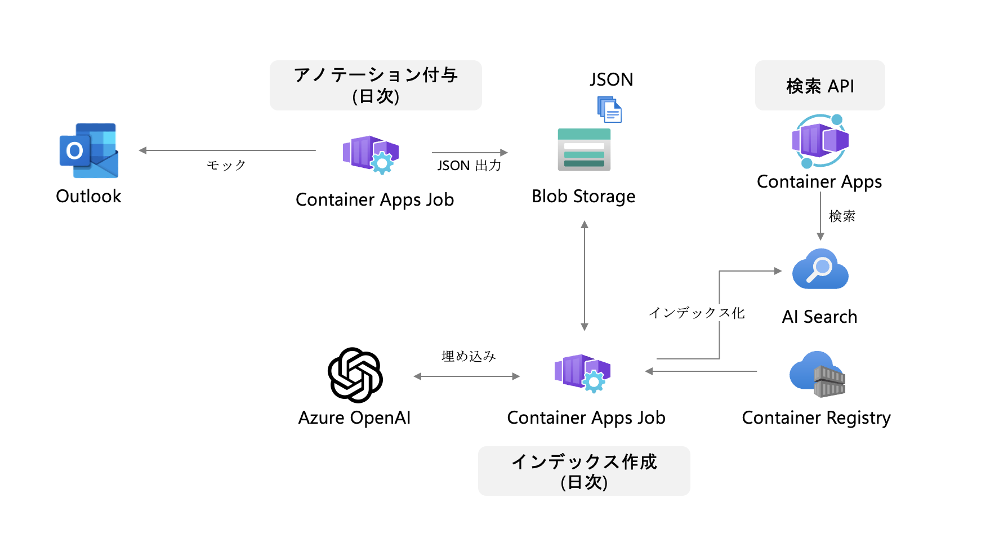

# Azure OpenAI を活用した固有表現抽出



## 0. 環境準備

プロジェクトを開始する前に、以下のツールがインストールされていることを確認してください。

- [Git](https://git-scm.com/download/win) - 本リポジトリをクローンするために必要です。

- [Azure CLI](https://learn.microsoft.com/ja-jp/cli/azure/install-azure-cli-windows?tabs=azure-cli) - Azure リソース展開時に必要です。

- [Azure Developer CLI](https://learn.microsoft.com/ja-jp/azure/developer/azure-developer-cli/install-azd?tabs=winget-windows%2Cbrew-mac%2Cscript-linux&pivots=os-windows) - Azure リソースを管理するために必要です。

- [Docker](https://docs.docker.com/engine/install/) - コンテナを展開するために必要です。

以下のリソースがデプロイされます:

- **Resource Group**: リソースを管理するためのコンテナ（リソースグループ）。
- **Azure Monitor**: アプリケーションの監視とログ収集を行います。
- **Azure Functions**: サーバーレスアプリケーションをホストします。
- **Azure OpenAI**: OpenAIモデルのホスティングと管理を行います。
- **Azure Container Apps**: コンテナベースのアプリケーションをホストします。
- **Azure Container Registry**: Dockerコンテナイメージの管理を行います。

リポジトリをローカル環境にクローンします。

```
git clone https://github.com/kohei3110/aoai-ner.git
cd aoai-ner
```

## 1. サービスプリンシパル登録・権限付与

### 1-1. Entra ID へのアプリケーション登録（サービスプリンシパル作成）

アプリケーション（インデックス作成ジョブ）で使用する認証情報を登録するため、Entra ID のアプリケーションを登録し、サービスプリンシパルを作成します。

まず、[クラウド アプリケーション管理者](https://learn.microsoft.com/ja-jp/entra/identity/role-based-access-control/permissions-reference#cloud-application-administrator)以上のユーザーで[Microsoft Entra 管理センター](https://entra.microsoft.com/)にサインインします。


[ID]、[アプリケーション]、[アプリ登録] の順に進み、**[新規登録]** を選択します。


アプリケーションに以下の設定をします。

- **名前**: 任意の名前（`app-NamedEntityRecognition-demo-001` など）。
- **サポートされているアカウントの種類**: この組織ディレクトリのみに含まれるアカウント。
- **リダイレクトURI**: 
    - **プラットフォーム**: `Web`
    - **値**: `http://localhost`


**登録**ボタンを押下し、アプリケーションを登録します。

### 1-2. 作成したサービスプリンシパルにロールを割り当てる

上記で作成したサービスプリンシパルに対し、ストレージアカウントに保存されたファイルを読み取るための権限を付与します。

まず、Azure Portal で対象となるストレージアカウントに遷移し、**[アクセス制御（IAM）]**、**[ロールの割り当ての追加]**の順に選択します。


**ストレージ Blob データ共同作成者** を選択し、**次へ**を押下。


`メンバー`にて、作成したアプリケーション名（`app-NamedEntityRecognition-demo-001` など）を選択し、**レビューと割り当て**を押下。


再度**レビューと割り当て**を押下し、権限を付与。

**参考**

- [Microsoft Entra アプリを登録し、サービス プリンシパルを作成する](https://learn.microsoft.com/ja-jp/entra/identity-platform/howto-create-service-principal-portal)
- [DefaultAzureCredential では環境変数を使うと便利です（Java on Azure）](https://qiita.com/kk31108424/items/a2b2d8079f9faae49721)

### 1-3. サービスプリンシパルの資格情報発行

プログラム内で Azure にサインインするときは、認証要求でディレクトリ (テナント) ID とアプリケーション (クライアント) ID を環境変数に保持する必要があります。証明書または認証キーも必要です。 

[Microsoft Entra 管理センター](https://entra.microsoft.com/)にサインインします。


[ID]、[アプリケーション]、[アプリ登録] の順に進み、作成したアプリケーション（`app-NamedEntityRecognition-demo-001` など）を選択します。

表示されている **アプリケーション（クライアント）ID**、**ディレクトリ（テナント）ID**をメモ帳にコピーします。


[証明書とシークレット] にて **+新しいクライアント シークレット**を選択し、シークレットを発行し、メモ帳にコピーします。シークレットは１度しか表示されないので、コピーし忘れに注意してください。


`app/annotation/Dockerfile.sample`をコピーし、`Dockerfile`という名前で保存します。

メモ帳にコピーした**アプリケーション（クライアント）ID**、**ディレクトリ（テナント）ID**、**クライアント シークレット**を、コピーした`Dockerfile`に貼り付けます。

- **AZURE_TENANT_ID**: ディレクトリ(テナント)IDの値
- **AZURE_CLIENT_ID**: アプリケーション(クライアント)IDの値
- **AZURE_CLIENT_SECRET**: クライアント シークレットの値

同様の手順を `app/createindex/Dockerfile.sample`、`app/search/Dockerfile.sample` にも行います。

## 2. Azure リソース作成

### 2-1. パラメーターファイルのコピーと修正

`infra/main.bicepparam` ファイルのパラメータの値を指定するように修正します。

デプロイ前に値を指定する必要があるパラメータは以下の通りです：

- environmentName: 作成されるリソースに使用される一意の名前。
- location: アセットが作成される場所。利用可能なリージョンは以下の通りです。

    - `australiaeast`
    - `eastasia`
    - `eastus`
    - `eastus2`
    - `northeurope`
    - `southcentralus`
    - `southeastasia`
    - `swedencentral`
    - `uksouth`
    - `westus2`

※ これらのリージョンは、パブリックプレビューの早期アクセス時に利用可能です。

例えば、East US リージョンにデプロイする際、`infra/main.bicepparam` を以下のように書き換えます。

```
using 'main.bicep'
param environmentName = 'dev'
param location = 'eastus'
```

### 2-２. デプロイ実行

Windows の場合は Windows Terminal から Git Bash を開き、以下のコマンドを実行します。

```
az login
azd auth login
azd init
```

環境名を聞かれるので、任意の値（`dev`など）を入力し、Enter を押します。

```
Initializing an app to run on Azure (azd init)

Enter a new environment name: dev
```

`SUCCESS: New project initiated` と表示されたら成功です。

Azure リソースを展開します。

```
azd up
```

※ Windows にて `Docker: "no matching manifest for windows/amd64 in the manifest list entries"` エラーが出た場合、システムトレイ内の Docker アイコンを右クリックし、Linux コンテナに切り替える必要があります（[参考](https://stackoverflow.com/questions/48066994/docker-no-matching-manifest-for-windows-amd64-in-the-manifest-list-entries)）。


**デプロイ先のサブスクリプション・リージョン**を Enter で選択します。本ハンズオンでは、リージョンを `East US` にすることを推奨します。

デプロイが完了すると、以下のようなリソースが作成されます。


### 2-3. Azure 上のアプリケーションの動作確認

Azure にデプロイ済みのアプリケーションを動作確認します。

#### 2-3-1. アノテーション付与用コンテナ（日次ジョブ）

Azure Portal から**コンテナー アプリ ジョブ**を検索します。

**cajannot** から始まるジョブを選択します。

**▷Run now** を押下し、アノテーション付与ジョブを実行します。


#### 2-3-2. 検索インデックス作成用コンテナ（日次ジョブ）

Azure Portal から**コンテナー アプリ ジョブ**を検索します。

**cajindex** から始まるジョブを選択します。

**▷Run now** を押下し、アノテーション付与ジョブを実行します。


### 2-4. 検索クエリ実行

検索クエリを実行します。ブラウザを開いて以下の URL を入力し、全文検索・ベクトル検索・ハイブリッド検索・セマンティックランク付けを試します。

`query` パラメータに、検索キーワードを入力します。

```
http://<Container Apps の URL>/fulltext?query=xxxxxxxxx

http://<Container Apps の URL>/vector?query=xxxxxxxxx

http://<Container Apps の URL>/hybrid?query=xxxxxxxxx

http://<Container Apps の URL>/semantic?query=xxxxxxxxx
```